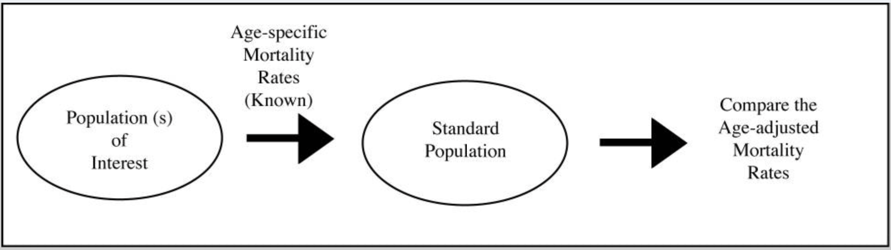

```{r setup, include=FALSE}
knitr::opts_chunk$set(echo = FALSE, cache=TRUE, message=FALSE, warning=FALSE,include=FALSE)
options(dplyr.summarise.inform = FALSE)
```


```{r libraries}
library(ggplot2)
library(knitr)
library(tidyverse)
library(ggthemes)
library(kableExtra)
library(here)
library(rmarkdown)
library(knitr)
library(readr)
library(dplyr)
library(sf)
library(ggrepel)
library(stringr)
library(scales)

```


```{r load_dataset}
df <- read_csv(here::here("data/cancer-deaths-rate-and-age-standardized-rate-index.csv"))
head(df)
```

# Executive Summary

Cancer is one of the leading causes of morbidity and mortality worldwide. While the fight against cancer started through the [National Cancer Act in 1971](https://www.cancer.gov/about-nci/overview/history/national-cancer-act-1971), the world still experiences __about ten million deaths a year__ due to this disease. Statistically, every sixth death can be attributed to cancer based on the study by @436429c1dfa446128cae9bc82b120952. This report is a global study on cancer prevalence and mortality rates across generations, by utilizing publicly available datasets to analyze cancer death rates across different cancer types, age groups and countries.  

While the fight against cancer is expected to be a drawn-out battle, it is prudent to understand the key statistics that would allow one to gauge the progress made by the Oncological Research Centers around the world against this deadly disease. 


Some of the key findings of the current study are delineated below:


- Cancer deaths increase with age, with the “70+” age group reporting the highest average cancer mortality rate worldwide. Temporal analysis also shows that cancer deaths have increased over time for older age groups, particularly for those aged 70 years and above. 

- Considerable regional variations in cancer type prevalence have been observed, with lung cancer being most common in high-income nations such as Australia, USA, Canada and India. 

- There is a positive correlation between sales of cigarettes and lung cancer death rates, meaning that higher sales is associated with a greater number of deaths. 

- While cancer deaths in 2019 have risen by 73% since the year of 1990, the world has observed a global drop in age-standardized death rates by 6% within the same time period, thereby marking a slow but significant progress against cancer.


# Introduction

Cancer has long been considered as one of the leading healthcare problems globally, with every one person in seven dying of this disease in Australia as per @canceraussie. Based on the data from [Cancer Australia](https://www.canceraustralia.gov.au/impacted-cancer/what-cancer/cancer-australia-statistics) the number of new cases of cancer diagnosed was found to rise from 47,414 in 1982 to 146,335 cases in 2018. A similar rise of cancer deaths has also been observed globally, making cancer one of the leading areas of intense research. Furthermore, according to @AGGARWAL20161040, lung cancer alone accounts for approximately 20% of total cancer mortality rates, estimated to be 1.6 million cancer deaths annually. Hence, understanding the impact of cancer among various cancer types, age groups, and regions is crucial for reducing the global burden of cancer.  

Based on the data from @doi:10.1513/pats.200809-100TH, it is widely known that smoking cigarettes is one of the major risks leading to lung cancer, accounting for almost 90% of lung cancer in men and 70% to 80% in women. In 2020, the outbreak of the COVID-19 pandemic had an adverse effect on the diagnosis and treatment of cancer as the healthcare industry was overburdened globally. This led to a short-term decrease in the number of early cancer diagnoses, resulting in an increase in both the number of cases diagnosed at advanced stages and mortality rates as reported by @yabroff2022association.

Unfortunately, the sale of cigarettes continues to be rampant in multiple countries, despite the multitude of initiatives undertaken to create awareness among the general population. The majority of cancer deaths take place in low and middle-income nations, where the burden of cancer is particularly heavy due to lack of appropriate healthcare infrastructure. Cancer has major economic and societal consequences, such as the price of treatment, lost productivity, and lowered quality of life for patients and their families. 

This report therefore aims to provide a global perspective on cancer prevalence and mortality rates across generations. The epidemiology of cancer can be better understood by understanding how cancer fatalities are distributed by kind, which will also help guide efforts to prevent and treat this disease. Based on the current analysis, the major cancer types in various nations have been identified which would allow for governments and health organizations to set priorities and allocate the required resources. Furthermore, as lung cancer was observed to be one of the major causes of concern in the healthcare industry, the study aims to explore the relationship between cigarettes sales and lung cancer death rate. Lastly, to understand the global progress for cancer treatment made by various cancer research centers, three critical metrics were evaluated to obtain a holistic picture of the global efforts taken to cure this deadly disease. These measures are: __the number of deaths, crude death rate and age-standardized death rate__. 


# Methodology

## Cancer by Age

Two publicly available datasets relating to global cancer deaths were obtained from the ["Our World in Data"](https://ourworldindata.org/cancer) website. The [first dataset](https://ourworldindata.org/grapher/cancer-death-rates-by-age) represents cancer death rates (i.e. number of cancer deaths per 100,000 people of the same age group per year) for each country whilst the [second dataset](https://ourworldindata.org/grapher/cancer-deaths-by-age?stackMode=relative) contains each country's total annual cancer deaths differentiated by broad age category. 

These datasets were selected based on their relevance to the following research questions:

1. How has the distribution of cancer death rates across different age groups changed over time? 
2. Which countries have the highest cancer deaths for the most affected age group? 

The most recent year available (except for time trends) was also selected as the base year, to ensure that the most up-to-date information is being analysed. 

To discover patterns, trends or relationships in the data, exploratory analysis was primarily used as well as descriptive statistics and data visualization techniques. A quick overview of cancer deaths across age groups in 2019 can be seen in Table \ref{tab:tableref}:  

```{r reading data, message = FALSE, warning = FALSE, eval = TRUE, echo = FALSE}

cancer_age <- read_csv(here::here("data/cancer-death-rates-by-age.csv"))

cancer_time <- read_csv(here::here("data/cancer-deaths-by-age-timetrend.csv"))

```


```{r tableref, include=TRUE, message = FALSE, warning = FALSE, eval = TRUE, echo = FALSE, fig.height = 4, fig.width = 4}

cancer_age_2019 <- cancer_age %>% 
  rename(Country = Entity,
         "Under 5 years old" = "Deaths - Neoplasms - Sex: Both - Age: Under 5 (Rate)",
         "5-14 years old" = "Deaths - Neoplasms - Sex: Both - Age: 5-14 years (Rate)",
         "15-49 years old" = "Deaths - Neoplasms - Sex: Both - Age: 15-49 years (Rate)",
         "50-69 years old" = "Deaths - Neoplasms - Sex: Both - Age: 50-69 years (Rate)",
         "70+ years old" = "Deaths - Neoplasms - Sex: Both - Age: 70+ years (Rate)") %>%
  filter(Year == 2019,
         !is.na(Code),
         Country != "World")

new_col_order <- c("Country", "Code", "Year",
                   "Under 5 years old", 
                   "5-14 years old", 
                   "15-49 years old",
                   "50-69 years old",
                   "70+ years old",
                   "Deaths - Neoplasms - Sex: Both - Age: Age-standardized (Rate)",
                   "Deaths - Neoplasms - Sex: Both - Age: All Ages (Rate)"
                   )

cancer_age_2019 <- cancer_age_2019[, new_col_order]

mean_death_rates <- cancer_age_2019 %>% 
  select("Under 5 years old", "5-14 years old", "15-49 years old", "50-69 years old", "70+ years old") %>%
  summarize(across(everything(), mean))

kable(mean_death_rates, align = "c", 
      caption = "Mean Cancer Death Rate by Age Group in 2019 (measured as number of cancer deaths per 100,000 people)") %>%
  kable_styling(bootstrap_options = c("striped", "hover"))

```

- Based on Table \ref{tab:tableref}, it was observed that across all the 204 countries observed, the ‘70+ years’ age group had the highest average cancer mortality rate. 
- Of people who are 70 years and older worldwide, more than 1% (i.e. approximately 1063 per 100,000) died from cancer in 2019.   

Taking this into account, a time series analysis was then conducted to study changes in cancer deaths by age group over time. 

```{r  worldmap, fig.height = 5, fig.width = 6, message = FALSE, warning = FALSE, eval = TRUE, echo = FALSE, include=TRUE, fig.cap = "World Map of All Countries"}


world_map <- read_sf(here::here("data/World_Countries_(Generalized)/World_Countries__Generalized_.shp"))


ggplot(world_map) +
  geom_sf(aes(geometry = geometry), 
          color = "black")

```

Finally, the geographic distribution of cancer deaths for the most impacted age group is visually represented through a global spatial map. This involved downloading the ["World Countries Generalized"](https://hub.arcgis.com/datasets/esri::world-countries-generalized/explore?location=-0.131846%2C0.000000%2C2.00) dataset to obtain specific location coordinates for each country. After removing zero/minus values from the ‘world_map’ spatial object and merging it with the first dataset, a world map plot was generated as seen in figure \ref{fig:worldmap}, which would later be used in the geographic distribution analysis. 

```{r  joinmap, message = FALSE, warning = FALSE, eval = TRUE, echo = FALSE}

cancer_age_2019 <- cancer_age_2019 %>%
  rename(COUNTRY = Country)
  
world_map <- st_zm(world_map) %>% 
  left_join(cancer_age_2019, by = "COUNTRY")

```

## Cancer by Type

The analysis covers the period between 1990 to 2016 and provides statistics on cancer deaths by type based on the [cancer mortality dataset](https://ourworldindata.org/grapher/cancer-deaths-by-type-grouped) from the Our World in Data website. These are broken down into broad categories such as lung, liver, stomach and breast cancer.  

After importing the data, the dataset was cleaned to eliminate any invalid or missing entries. The data was then filtered to include only major countries with the highest GDPs. This was followed by a computation of the percentage of each type of cancer in relation to the overall number of cancer deaths per year. 

To visualise the distribution of cancer mortality by type over time, a stacked bar chart (as seen in figure \ref{fig:dataadd}) was utilised. This chart displays the occurrences of each form of cancer among all cancer fatalities, facilitating a comparison of the contribution of each type of cancer to the overall burden of cancer in the year 2016.  


```{r dataadd, include=TRUE, fig.cap = "Average Cancer Death Rates by Type (2016)"}


cancer_data <- read_csv(here::here("data/cancer-deaths-by-type-grouped.csv"))
# Filter the data to include only the selected countries
selected_countries <- cancer_data %>%
  filter(Entity %in% c("United States", "Canada", "Australia", "India"))

# Create a DT table for the selected countries

# Pivot the data to create a table of cancer types by country
cancer_table <- selected_countries %>% filter(Year==2016) %>% 
  pivot_longer(cols = `Other cancers (deaths)`:`Tracheal, bronchus, and lung cancer (deaths)`,
               names_to = "Category",
               values_to = "Rate") %>%
  group_by(Category) %>% summarise(Mean_death_rate = mean(Rate))


ggplot(cancer_table, aes(x = Category, y = Mean_death_rate)) +
  geom_col(position = "dodge") +
  theme_classic() +
  theme(axis.text.x = element_text(angle = 45, hjust = 1,size = 6,face = 'bold')) +
  labs(y='Mean death rate',x='Cancer type') 

```


## Lung Cancer & Sales of Cigarettes

This section uncovers the relationship between lung cancer death rates (annually) with the daily sales of cigarettes (annually). Two research questions that will be the main focus of this analysis are: 

1. Do the sales of cigarettes have any correlation to increasing/decreasing lung cancer death rates?
2. How is the relationship between both variables?

In performing the analysis, the dataset containing annual lung cancer death rates and daily average sales of cigarettes will be utilised, which can be accessed from the [Our World in Data website](https://ourworldindata.org/cancer#smoking-and-lung-cancer). Before the analysis, an overview of the current death rate profile over the years is presented.

```{r figure1, fig.cap = "Annual Death Rate of Lung Cancer from 1950 to 2020.", out.width = "100%", fig.width = 16, fig.height = 3, fig.align = "center", eval = TRUE, echo = FALSE, messages = FALSE, warning = FALSE, include=TRUE}
lung_cancer <- read_csv(here::here("data/lung-cancer-deaths-per-100000-by-sex-1950-2002.csv"), show_col_types = FALSE)

lung_cancer_tidy <- lung_cancer %>% select(!Code) %>%
                                    pivot_longer(cols = -1:-2,
                                                 names_to = "gender",
                                                 values_to = "death_rate") %>%
                                    mutate(gender = as.character(gender),
                                           Year = as.character(Year)) %>%
                                    mutate(gender = str_replace_all(gender, "age-standardized_death_rate_per_100k_", ""))
                                    
lc_summarised <- lung_cancer_tidy %>%
                 select(Year, death_rate) %>%
                 group_by(Year) %>%
                 summarise(avg_death_rate = round(mean(death_rate),2)) %>%
                 arrange(Year)

#Plotting the trend of Lung Cancer Death Rate
ggplot(lc_summarised,
       aes(x = Year,
           y = avg_death_rate,
           group = 1)) +
       geom_line(color = "orange", size = 1.2) +
       geom_point() +
       theme_clean() +
       theme(axis.text.x = element_text(angle = 90, vjust = 0.5),
             text = element_text(size = 15)) +
       labs(x = "Year",
            y = "Avg Death Rate (%)") 
```
Based on figure \ref{fig:figure1}, there is a gradual increase of lung cancer death rates from 1950 until 1988, followed by a gradual decrease after 1988 until 2020. The influence of cigarette sales on these gradual increases/decreases are explained further in the results. 

To further support the analysis, a new graph will be included using a statistical technique called "smoothing". This graph is a scatter plot that presents a smooth curve, providing a more accurate representation of the relationship between the sale of cigarettes and lung cancer death rates. The smooth curve will assist in validating the analysis and ensure the findings are more reliable. 

Table \ref{tab:table1} is a preview of the dataset that will be used in this analysis, ranging from the year, the average death rates of lung cancer, and the average sales of cigarettes daily, which reveals the relationship between cigarette sales and lung cancer death rates.

\newpage

```{r table1, fig.cap = "Preview of the dataset with variables of year, average sales of cigarettes daily, and the average death rates of lung cancer.", out.width = "100%" , fig.align = "center", fig.width = 8, fig.height = 2, eval = TRUE, echo = FALSE, include=TRUE}
cigs_sales <- read_csv(here::here("data/sales-of-cigarettes-per-adult-per-day.csv"), show_col_types = FALSE)

cigs_sales_tidy <- cigs_sales %>%
                   mutate(Year = as.character(Year)) %>%
                   rename(cigs_sales_daily = `Sales of cigarettes per adult per day (International Smoking Statistics (2017))`) %>%
                   select(Entity, Year, cigs_sales_daily)

lc_cigs_summarised <- cigs_sales_tidy %>%
                        select(Year, cigs_sales_daily) %>%
                        group_by(Year) %>%
                        summarise(cigs_sales_daily = mean(cigs_sales_daily)) %>%
                        left_join(lc_summarised, by = "Year") %>%
                        filter(Year %in% 1950:2015)
                        

lc_cigs_summarised_table <- lc_cigs_summarised %>% 
                            rename("Average Daily Cigarettes Sales" = "cigs_sales_daily",
                               "Average Death Rates" = "avg_death_rate")

knitr::kable(head(lc_cigs_summarised_table), booktabs = TRUE, 
             caption = "Preview of the dataset with variables of year, average sales of cigarettes daily, and the average death rates of lung cancer.")
```

## Is the World Making Progress Against Cancer?

The current study utilizes three major metrics to understand the global progress in the fight against cancer:

1. Cancer deaths
2. Cancer death rate (__Non age standardized__)
3. Cancer death rate (__Age standardized__)

While usage of crude statistics such as absolute number of deaths and rate of deaths allows us to understand the overall loss of lives as a result of cancer, it is heavily affected by the number of people constituted in each age group. As age distributions drastically differ for the global population with lesser number of elderly population above the age of 80 years as compared to the younger population, hence, a statistical treatment is required which would allow for us to adjust the crude rate in order to eliminate the effect of differences in population age structures when comparing crude rates for different periods of time, different geographic areas or different population sub-groups. As a result, in Epidemiology, __age standardized death rates__ are calculated to study the overall progress of treatments against diseases.

```{r, include=TRUE,out.height = '150px', out.width= '450px', fig.cap= 'Age standardisation process'}
 
```
Based on [The Australian Institute of Health and Welfare](https://meteor.aihw.gov.au/content/327276), the direct method for age-standardization rate is calculated as below:


$$Standardisation\;rate = \frac{\sum(r_iP_i)}{\sum{P_i}}$$

Where, 

$r_i =$ is the age-group specific rate for age group i in the population being studied.

$P_i =$ is the population of age group i in the standard population.


```{r ratecalc,include=TRUE}


df_rate <- df %>% rename("standardized_death_rate"="Deaths - Neoplasms - Sex: Both - Age: Age-standardized (Rate)",
                  "crude_death_rate"="Deaths - Neoplasms - Sex: Both - Age: All Ages (Rate)",
                  "absolute_deaths"="Deaths - Neoplasms - Sex: Both - Age: All Ages (Number)")


df_rate <- df_rate %>% group_by(Entity) %>%
  mutate(perc_abs_death = (absolute_deaths / first(absolute_deaths) - 1) * 100) 

df_rate$perc_abs_death <- round(df_rate$perc_abs_death,0)

df_rate <- df_rate %>% group_by(Entity) %>%
  mutate(perc_death_rate = (crude_death_rate / first(crude_death_rate) - 1) * 100)

df_rate$perc_death_rate <- round(df_rate$perc_death_rate,0)

df_rate <- df_rate %>% group_by(Entity) %>%
  mutate(perc_std_death_rate = (standardized_death_rate / first(standardized_death_rate) - 1) * 100)

df_rate$perc_std_death_rate <- round(df_rate$perc_std_death_rate,0)

df_long <- df_rate %>% pivot_longer(cols=c(standardized_death_rate,crude_death_rate),
                                    names_to = "Statistic",
                                    values_to = "Values")

df_summary <- df_rate %>% summarise_at(c('standardized_death_rate','crude_death_rate'),mean,na.rm=TRUE) %>%
  arrange(-crude_death_rate)

df_summary$standardized_death_rate <- round(df_summary$standardized_death_rate,0)
df_summary$crude_death_rate <- round(df_summary$crude_death_rate,0)
df_summary <- df_summary %>% rename("Country"=Entity,
                                    "Mean standardized death rate"=standardized_death_rate,
                                    "Mean crude death rate"=crude_death_rate)
  
head(df_summary,10) %>% kable(caption = 'Countries with highest mean death rates',booktabs = TRUE) %>% 
kable_styling(bootstrap_options = c("bordered","hover"))

```

```{r boxplot,include=TRUE,fig.align='center',fig.cap="Distribution of crude and standardized age deaths",fig.height=3,fig.width=4}

labels <- c("Crude death rate","Age standardized death rate ")

pl1 <- ggplot(data=df_long, aes(y=Values,x=Statistic,fill=Statistic)) + 
  geom_boxplot() +
  ggtitle("Distribution of \ncrude and standardized age deaths") +
  theme_classic() +
  scale_x_discrete(labels=labels) +
  labs(x="Type of death rate", y="Deaths per 100,000 people") +
  theme(legend.position = 'none', 
  plot.title = element_text(hjust=0.5,
  face = 'bold',size = 10),axis.text.x = element_text(face = 'bold'))
print(pl1)
```

While __the mean crude death rates are observed to rise as a result of greater population, the mean standardized death rates are however considerably lower__ for countries with high death rates as observed through Table \ref{tab:ratecalc}. This phenomenon can be clearly observed through the distribution of these variables as illustrated by the boxplots in figure \ref{fig:boxplot} where the __outliers for crude death rates are considerably higher than those for age standardized death rates__.


# Results \label{section:results}

## Cancer by Age

Figure \ref{fig:linegraph} illustrates the number of cancer deaths in different age groups worldwide over a 29-year period. Based on the line graph, it’s evident that cancer deaths increased with age. Both “50-69” and “70+” age groups exhibited a clear upward trend between the years 1990-2019, whilst younger age groups (i.e. those aged under 5 years, 5-14 years and 15-49 years) showed relatively stable trends with significantly fewer cancer deaths compared to the older age groups. However, one interesting observation is that between 1990-1998, the “50-69” age group had the highest number of cancer deaths before being surpassed by the “70+” age group thereafter. Moreover, the line representing “70+ years old” portrayed a steeper upward trend compared to “50-69 years” from 1995 onwards, indicating a more rapid increase in cancer deaths over time for people aged 70+ years and above. 

```{r  totalcancerdeaths, message = FALSE, warning = FALSE, eval = TRUE, echo = FALSE}

cancer_time <- cancer_time %>%
  rename("Under 5 years old" = "Deaths - Neoplasms - Sex: Both - Age: Under 5 (Number)",
         "5-14 years old" = "Deaths - Neoplasms - Sex: Both - Age: 5-14 years (Number)",
         "15-49 years old" = "Deaths - Neoplasms - Sex: Both - Age: 15-49 years (Number)",
         "50-69 years old" = "Deaths - Neoplasms - Sex: Both - Age: 50-69 years (Number)",
         "70+ years old" = "Deaths - Neoplasms - Sex: Both - Age: 70+ years (Number)") %>%
  filter(!is.na(Code),
         Entity != "World")

total_cancer_deaths <- cancer_time %>%
  group_by(Year) %>%
  summarize(`Under 5 years old` = sum(`Under 5 years old`),
            `5-14 years old` = sum(`5-14 years old`),
            `15-49 years old` = sum(`15-49 years old`),
            `50-69 years old` = sum(`50-69 years old`),
            `70+ years old` = sum(`70+ years old`))
         
```


```{r linegraph, fig.height = 4, fig.width = 6, message = FALSE, warning = FALSE, eval = TRUE, echo = FALSE, include=TRUE, fig.cap = "Total Cancer Deaths by Age Group over Time (for global population)"}

total_cancer_deaths_long <- tidyr::pivot_longer(total_cancer_deaths, 
                                                cols = c(`Under 5 years old`, `5-14 years old`, `15-49 years old`, `50-69 years old`, `70+ years old`), 
                                                names_to = "Age_Group", 
                                                values_to = "Total_Deaths")


total_cancer_deaths_long$Age_Group <- factor(total_cancer_deaths_long$Age_Group,
                                         levels = c("Under 5 years old", "5-14 years old", "15-49 years old",
                                                    "50-69 years old", "70+ years old"))

ggplot(total_cancer_deaths_long, aes(x = Year, y = Total_Deaths, color = Age_Group)) +
  geom_line() +
  geom_point() +
  theme_minimal() +
  labs(x = "Year",
       y = "Total Deaths (millions)",
       color = "Age Group") +
  scale_y_continuous(labels = scales::comma) 

```

With cancer deaths being more prevalent in older age groups, we then identified countries with the highest cancer death rates (i.e. number of cancer deaths per 100,000 people) for people 70+ years and older. According to figure \ref{fig:figure2}, some of the top countries in 2019 were Greenland, Mongolia, United Kingdom, Netherlands, San Marino, Andorra, Monaco, Uruguay, Dominica and Barbados. It appears that majority of the affected countries were smaller ones with relatively low population densities, compared to larger countries such as Brazil and China. Additionally, we also found that Australia, European and North American countries experienced higher cancer mortality rates compared to countries in Africa and Asia.

```{r  figure2, fig.height = 8, fig.width = 8, message = FALSE, warning = FALSE, eval = TRUE, include= TRUE, echo = FALSE, fig.cap = "Countries with Highest Cancer Death Rates for People Aged 70+ Years and Over, measured as number of cancer deaths per 100,000 people (2019)"}

world_map_2019 <- world_map %>%
  select("COUNTRY", "Code", "70+ years old", ISO, SHAPE_Leng, SHAPE_Area, geometry) 

world_map_2019$Code <- as.factor(world_map_2019$Code)

top_10_countries <- world_map_2019 %>%
  top_n(10, wt = `70+ years old`) %>%
  st_centroid()

ggplot() +
  geom_sf(data = world_map_2019, aes(geometry = geometry, fill = `70+ years old`), 
          color = "white") +
  geom_sf_text(data = world_map_2019, aes(geometry = geometry, label = "•"),
               size = 4, color = "black") + 
  geom_label_repel(data = top_10_countries,
                  aes(x = st_coordinates(geometry)[, 1],
                      y = st_coordinates(geometry)[, 2],
                      label = COUNTRY),
                  size = 1.7, fontface = "bold", 
                  segment.color = NA, nudge_x = 1, nudge_y = 1) +
  scale_fill_gradient(low = "lightblue", high = "darkblue") +
  scale_size_continuous(range = c(2, 10), labels = scales::comma) +
  coord_sf(crs = st_crs(world_map_2019), xlim = c(-130, 150), 
           ylim = c(-60, 100))
```

Section \ref{section:cancertype} examines overall cancer death rates by type in countries previously identified as having high cancer deaths rates among older populations. These cancer types range from lung, breast, kidney, to brain cancer. Furthermore, this section offers additional insights into which types of cancer are observed to record the highest and lowest mortality rates. 

## Cancer by Type \label{section:cancertype}

The number of lung, breast, kidney, and brain cancer fatalities in USA, India, China, and Australia is depicted in the bar plot . Only these nations and cancer types from the initial dataset were included in the data after it had been filtered.

The figure illustrates that lung cancer is the primary cause of cancer fatalities in all four nations, with China having the highest death toll (over 500,000) and Australia having the lowest (about 7,000). Breast cancer is the second most prevalent type of cancer to cause death, with over 80,000 fatalities occurring in India and only 3,000 in Australia. Compared to lung and breast cancers, deaths from kidney and brain malignancies are significantly lower in each of the four countries.

Due to its identification as the leading cancer type, lung cancer will be the subject of further investigation in section \ref{section:lungcancer}. The analysis will dive deeper into the reasons for lung cancer prevalence and explore the impact of cigarette sales on its rising mortality rates. By examining sales data of cigarettes, the analysis aims to shed light on the correlation between cigarette sales and the increasing number of lung cancer deaths.


## Lung Cancer & Sales of Cigarettes \label{section:lungcancer}

This analysis looks at the relationship between lung cancer death rates and daily sales of cigarettes by examining their trend over the years. It is depicted through a scatter plot that will further validate the relationship of these two variables.

**The trend is visualised in below graph:**
```{r Trend1, fig.cap = "The Trend of Lung Cancer Death Rates and Sales of Cigarettes.", out.width = "100%" , fig.align = "center", fig.width = 16, fig.height = 4, eval = TRUE, echo = FALSE, include=TRUE}
scale = 2

ggplot(lc_cigs_summarised,
       aes(x = Year,
           group = 1)) +
  geom_line(aes(y = avg_death_rate), color = "orange", size = 1.2) +
  geom_point(aes(y = avg_death_rate), size = 2) +
  geom_line(aes(y = cigs_sales_daily*scale), color = "red", size = 1.2) +
  geom_point(aes(y = cigs_sales_daily*scale), size = 2, shape = 24, fill = "black") +
  scale_y_continuous(sec.axis = sec_axis(~.*scale, name="AVG Cigarettes Sales")) + 
  theme(axis.title.y = element_text(color = "black", size=10),
        axis.title.y.right = element_text(color = "black", size=10)) +
  labs(x = "Year",
       y = "AVG Death Rate (%)") +
  theme_minimal() +
  theme(axis.text.x = element_text(angle = 90, vjust = 0.5)) +
  theme(plot.title = element_text(size = 10),
        text = element_text(size = 15),
        legend.position = "bottom")
```

- Figure \ref{fig:Trend1} showcases the trend of cigarette sales and lung cancer death rates. As can be seen, when cigarette sales increase, the death rate tends to also increase. This condition also applies in reverse, whereby a fall in cigarette sales is followed by lower death rates not long after. This could be the first indication of a positive relationship between these two variables. Figure \ref{fig:CorrViz} provides a more comprehensive examination of the connection between these two variables, allowing for a deeper understanding of their relationship.


**The smoothing technique can be seen in below graph:**
```{r CorrViz, fig.cap = "The correlation between Lung Cancer Death Rates with Sales of Cigarettes.", out.width = "100%" , fig.align = "center", fig.width = 10, fig.height = 2, eval = TRUE, echo = FALSE, include=TRUE}

cigs_sales_summ <- cigs_sales_tidy %>%
                    select(Entity, Year, cigs_sales_daily) %>%
                    group_by(Entity, Year) %>%
                    summarise(cigs_sales_daily = mean(cigs_sales_daily))

lung_cancer_summ <- lung_cancer_tidy %>%
                    select(Entity, Year, death_rate) %>%
                    group_by(Entity, Year) %>%
                    summarise(death_rate = mean(death_rate))
  
lung_cigs_summ <- lung_cancer_summ %>%
                    left_join(cigs_sales_summ, by = c("Entity" , "Year")) %>%
                    filter(Year %in% 1950:2015,
                           !is.na(cigs_sales_daily))


#Plotting a scatter plot to show the relationship
ggplot(lc_cigs_summarised,
       aes(x = cigs_sales_daily,
           y = avg_death_rate)) +
  geom_point() +
  theme_clean() +
  geom_smooth(formula = y ~ x, method = "lm") +
  labs(x = "AVG Cigarettes Sales Daily",
       y = "AVG Death Rate (%)") +
  theme(plot.title = element_text(size = 12),
        text = element_text(size = 10))
```
- Figure \ref{fig:CorrViz} shows a scatter plot graph that illustrates the relationship between lung cancer death rates and the average daily number of cigarettes sold. The blue curve line in the graph represents a smoothed trend line that outlines the correlation between these two variables. Since the curve line is upward sloping, this indicates a positive correlation between the variables, meaning as the average daily number of cigarettes sold increases, lung cancer death rates tend to increase as well. This supports what was previously mentioned in Figure \ref{fig:Trend1} where cigarettes sales and lung cancer death rates were found to be directly related.

With the multitude of initiatives to fight cancer, how far has the world progressed in its ability to combat cancer? Is there an overall decline in cancer deaths? Has the situation improved for all nations irrespective of their economic status? Section \ref{section:improve} explains how various initiatives have impacted global cancer metrics.


## Is the World Making Progress Against Cancer? \label{section:improve}

```{r df_lineplot}
df_world_stats <- df_rate %>% group_by(Year) %>% 
  summarise_at(c('standardized_death_rate','crude_death_rate','absolute_deaths'),mean,na.rm=TRUE) %>% 
  mutate(perc_abs_death = (absolute_deaths / first(absolute_deaths) - 1) * 100) %>%
  mutate(perc_death_rate = (crude_death_rate / first(crude_death_rate) - 1) * 100) %>% 
  mutate(perc_std_death_rate = (standardized_death_rate / first(standardized_death_rate) - 1) * 100)
  
```

```{r lineplot,include=TRUE,fig.align='center',fig.cap='Change in cancer mortality metrics from 1990 to 2019',fig.height=4,fig.width=6}

df_world_stats_long <- df_world_stats %>% pivot_longer(cols = perc_abs_death:perc_std_death_rate,
                                                       names_to = "Statistic",
                                                       values_to = "Value")

df_world_stats_long <- df_world_stats_long %>% mutate(Statistic = recode(Statistic, 'perc_abs_death' = 'Relative change in absolute death',
                                                                         'perc_death_rate' = 'Relative change in death rate (Non age standaridized)',
                                                                         'perc_std_death_rate' = 'Relative change in death rate (Age standaridized)'))
label <- c("Relative change in absolute death","Relative change in death rate (Non age standaridized)","Relative change in death rate (Age standaridized)")

data_ends <- df_world_stats_long %>% filter(Year==2019)

pl2 <- ggplot(data=df_world_stats_long, aes(x=Year,y=Value,color=Statistic)) + 
  geom_line() + geom_point() +
  ggtitle('Change in cancer mortality metrics from 1990 to 2019',subtitle = "Relative changes in comparison to 1990 \nper 100,000 people") +
  theme_clean() +
  labs(y="Relative change in \n mortality metric (%)") +
  theme(legend.position='none',plot.title = element_text(hjust=0.5),plot.subtitle = element_text(hjust=0.5,size=8)) +
  geom_text_repel(aes(label = Statistic), data=data_ends,size = 2,color='black',nudge_x=5,nudge_y = 4)
  
print(pl2)
                                                      
```
In order to obtain a holistic understanding of the global progress against cancer, it is important to assess multiple metrics. Based on the current study, the key findings obtained through figure \ref{fig:lineplot} are as follows:

1. __Cancer deaths__ were observed to __rise by approximately 73% globally__ since 1990. However, this is not entirely unexpected as greater deaths related to cancer are __reported due to a growing population__. While a rise in the number of cancer deaths is not ideal, it also suggests that a greater proportion of deaths were not attributed to cancer due to a higher global population. Hence, absolute number of deaths may not be a reliable metric to assess the cancer treatment progress globally.

2. __Non-age standardized death rate__ due to cancer was observed to __rise by approximately 30%__. In order to account for the rising population, death rates are statistically calculated for the number of cancer deaths for every 100,000 people. This plot illustrates that __if the global population would have been constant, death rates as a result of cancer would have risen by 30% instead of 73%__.

3. __Age standardized death rate__ due to cancer was observed to __drop by 6%__ since 1990. As cancer majorly causes deaths in older population of ages 70 years or older, hence, it is important to study the age-standardized death rate metric. As age is an important contributor to cancer deaths, an age-standardized death rate would allow for correcting the age-profile variations within the same time period. Therefore, the plot in figure \ref{fig:lineplot} indicates that __if the age profiles would have remained uniform across the time period and countries, death rates would have reduced by 6% since 1990 instead of rising to 73%__.

# Discussion, Conclusion, and Recommendations

## Conclusion

To summarize, cancer deaths are more prevalent in older age groups, as shown by rising trends in the “50-69” and “70+” age groups over time. Countries with relatively small populations, such as Greenland and Mongolia, are also revealed to have higher cancer death rates among the elderly population; hence, special attention should be given to these countries in terms of targeted interventions and resources for cancer prevention and control.   

Yet, while age is a well-established risk factor for cancer, it is not the only one. This report does not capture the influence of socioeconomic and cultural factors (e.g. income, education, access to healthcare) on cancer risk and outcomes. Further research should also be conducted to better understand the significance of other risk factors such as tobacco and alcohol use, family genetics, exposure to carcinogens, unhealthy diets, and lack of physical activity. This could help in developing more comprehensive cancer prevention and control strategies.  

Among the most prevalent types of cancer in USA, India, China and Australia, lung cancer poses a significant public health concern. Additionally, breast, kidney, and brain cancers also contribute to cancer mortality in these nations.  

While lung cancer may not result solely from smoking behaviour, smoking is one of the greatest factors contributing to its development. Based on the analysis results, we can conclude that there is a positive correlation between sales of cigarettes and lung cancer death rates, meaning that higher sales is associated with a greater number of deaths.  

The report therefore evaluates three major metrics for the period between 1990 to 2019 as outlined in section \ref{section:results}. Based on the findings, it can be inferred that while the absolute values of cancer deaths have risen by 73% since 1990, the non-age- standardized cancer death rates per 100,000 people rose only by 30% while the age-standardized cancer death rates dropped by 6%. These show that cancer death rates are governed majorly by population growth and population age distribution.  

The data illustrated in figure 7 also indicates a slow progress made against cancer globally. This could be related to a drop in tobacco consumption, particularly in the richer countries as per the [World Health Organisation](https://www.who.int/news/item/16-11-2021-tobacco-use-falling-who-urges-countries-to-invest-in-helping-more-people-to-quit-tobacco). 

While cancer is one of the leading causes of fatal health problems which have involved significant global investment to solve, a 6% drop in death rate __implies a slow but significant progress for humankind__. Greater progress in preventing cancer fatalities have been observed for richer countries than the poorer countries. In this global war against cancer, it is important to be __inclusive__ and help poor countries through state of the art technologies aswell as for the economically affluent countries to keep pushing the boundaries in the various frontiers of cancer research.

## Recommendations 

Overall, public health initiatives should aim to prevent and detect these malignancies, while further investigation is needed to determine the causes of the cancer rates and prognoses in these nations. 

For instance, cancer prevention and early detection efforts in older age groups should be prioritized. Policy makers and healthcare professionals should look towards providing more targeted screening programs, education on cancer risk factors and healthy lifestyle choices, as well as improved access to appropriate healthcare services for the elderly population. 

There are also multiple suggestions for policy makers to reduce lung cancer mortality. One effective measure is imposing higher taxes on cigarettes sales, as this would discourage people from buying them due to the increased cost. Secondly, banning cigarette advertisements would limit their exposure and decrease their visibility to the public. Last but not least, providing free support, counselling or resources for individuals who want to quit smoking can encourage them to use them, which could be an effective measure for reducing smoking rates. 


